# Ulanzi Demo Plugin

[](https://github.com/zentala/ulanzi-deck-d200-plugin-example/actions/workflows/ci.yml)
[](../../../../LICENSE)
[](tests/)

Reference implementation of an Ulanzi D200 plugin using the official SDK.
Demonstrates canvas rendering, settings persistence, lifecycle event handling,
Property Inspector wiring, and HTTP fetch across six independent actions.

## Actions

| Action | UUID | Description |
|--------|------|-------------|
| Clock | `io.zentala.ulanzideck.demo.clock` | Digital clock with animated seconds-progress border. Tap toggles between two configurable IANA timezones (defaults: Europe/Warsaw and UTC). |
| Counter | `io.zentala.ulanzideck.demo.counter` | Tap-to-count, configurable step / direction / colors, persisted settings. |
| CPU Status | `io.zentala.ulanzideck.demo.status` | CPU load + temperature monitor with EMA smoothing. Reads LibreHardwareMonitor HTTP API; falls back to a Web Worker timing benchmark. |
| Calendar | `io.zentala.ulanzideck.demo.calendar` | Torn-off calendar style — day, month name, year, day-of-week. Tap opens a configurable calendar URL. |
| Pomodoro | `io.zentala.ulanzideck.demo.pomodoro` | Work/break timer state machine. Configurable durations; auto-pauses when the view is hidden. |
| Weather | `io.zentala.ulanzideck.demo.weather` | Current temperature + condition from open-meteo.com (no API key). Configurable location, label, units, refresh interval. |

UUIDs live in [`plugin/uuids.js`](plugin/uuids.js) — single source of truth shared by `app.js`, every Property Inspector, and the Jest tests. Keep in sync with [`manifest.json`](manifest.json).

## Action previews

Every action's button render captured deterministically (fixed clock = Sat 14 Mar 2026, 09:41) by [`scripts/generate-action-previews.mjs`](scripts/generate-action-previews.mjs). Regenerated automatically by the pre-commit hook whenever a `plugin/actions/*Action.js` file changes — see [Updating previews](#updating-previews) below.

### Core actions

| Clock | Counter | CPU Status | Calendar |
|:---:|:---:|:---:|:---:|
| 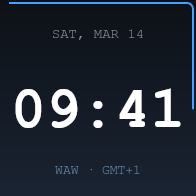 | 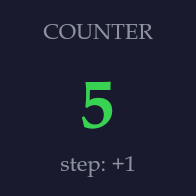 | 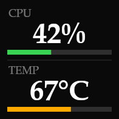 | 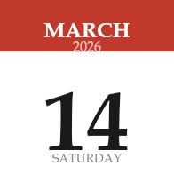 |

### Pomodoro states

| Idle | Work (mid-session, 2 completed) |
|:---:|:---:|
| 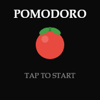 | 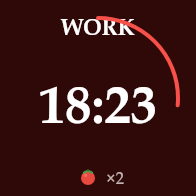 |

### Weather — full WMO condition matrix

| Clear | Partly cloudy | Overcast | Fog |
|:---:|:---:|:---:|:---:|
| 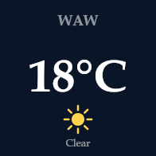 | 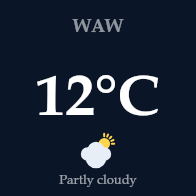 | 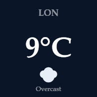 | 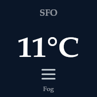 |
| **Drizzle** | **Rain** | **Snow** | **Thunderstorm** |
| 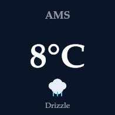 | 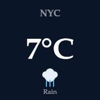 | 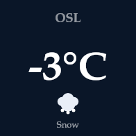 | 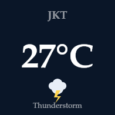 |
| **Fahrenheit** | **Loading** | **Offline** | |
| 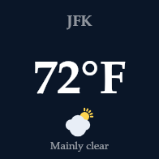 | 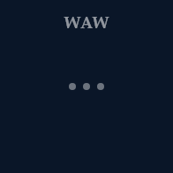 | 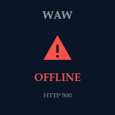 | |

All weather icons are drawn with canvas vector primitives — no emoji font dependency, identical render across every Chromium build the D200 firmware might ship.

## Requirements

- **UlanziStudio** running (the WebSocket bridge to the device).
- Node.js / Chromium environment provided by UlanziStudio.
- The two git submodules below initialised.

## Installation

1. Initialise the submodules (if you didn't clone with `--recurse-submodules`):

   ```bash
   git submodule update --init --recursive
   ```

2. Create a symlink so UlanziStudio discovers the plugin:

   **Windows (run as Administrator):**
   ```cmd
   mklink /D "%APPDATA%\ulanzi\plugins\io.zentala.ulanzideck.demo.ulanziPlugin" ^
     "C:\path\to\repo\ulanzi-demos\plugins\demo\io.zentala.ulanzideck.demo.ulanziPlugin"
   ```

   **macOS / Linux:**
   ```bash
   ln -s "$(pwd)/ulanzi-demos/plugins/demo/io.zentala.ulanzideck.demo.ulanziPlugin" \
     "$HOME/Library/Application Support/ulanzi/plugins/io.zentala.ulanzideck.demo.ulanziPlugin"
   ```

3. Restart UlanziStudio. The "Ulanzi Demo" plugin will appear in the action list.

## Development

```bash
pnpm install
pnpm test             # Jest, 126 tests covering every action + dispatcher + manifest
pnpm lint
pnpm format
pnpm generate-icons   # regenerate the action icons (assets/icons/*.png) via @napi-rs/canvas
pnpm previews         # regenerate the action button previews (assets/previews/*.png)
```

A Husky pre-commit hook runs lint, format check, typecheck on staged files. **Pre-push** runs the full Jest suite. **Pre-commit also auto-regenerates `assets/previews/*.png` whenever any `plugin/actions/*Action.js` file is staged**, then stages the regenerated PNGs — so README screenshots stay in sync with the code by construction.

### Updating previews

The rule, in short: **after touching any action's `render()`, regenerate previews and commit them in the same change.**

- Manual: `pnpm previews`
- Automatic: just commit your action changes — the pre-commit hook runs `pnpm previews` and `git add assets/previews/` for you.
- Adding a new action? Append a snapshot block to [`scripts/generate-action-previews.mjs`](scripts/generate-action-previews.mjs) and update the README preview table.

The script is deterministic (fixed Date, mocked fetch) so PNGs change *only* when render code changes — no spurious diffs from wall-clock time advancing.

## Assets

- `assets/icons/*.png` — 72×72 action icons shown in the UlanziStudio action picker. Generated by [`scripts/generate-icons.mjs`](scripts/generate-icons.mjs).
- `assets/previews/*.png` — 196×196 button render captures used in this README. Generated by [`scripts/generate-action-previews.mjs`](scripts/generate-action-previews.mjs).

## Project structure

```
io.zentala.ulanzideck.demo.ulanziPlugin/
├── manifest.json              Plugin descriptor (UUIDs, actions, OS support)
├── en.json                    Localisation strings
├── assets/
│   ├── icons/                 Generated action icons shown in UlanziStudio (72×72)
│   └── previews/              Generated button-render screenshots embedded in README (196×196)
├── libs/
│   ├── plugin-common-node/    Node.js SDK bridge (submodule)
│   └── plugin-common-html/    HTML/CSS PI bridge (submodule)
├── plugin/
│   ├── app.html               Entry point — script load order matters
│   ├── app.js                 Event dispatcher (UUID → Action instance)
│   ├── uuids.js               Shared UUID constants
│   └── actions/
│       ├── BaseAction.js
│       ├── ClockAction.js
│       ├── CounterAction.js
│       ├── StatusAction.js
│       ├── CalendarAction.js
│       ├── PomodoroAction.js
│       └── WeatherAction.js
├── property-inspector/        One folder per action
│   ├── clock/inspector.html
│   ├── counter/inspector.html
│   ├── status/inspector.html
│   ├── calendar/inspector.html
│   ├── pomodoro/inspector.html
│   └── weather/inspector.html
├── scripts/generate-icons.mjs
└── tests/                     Jest, 123 tests
```
